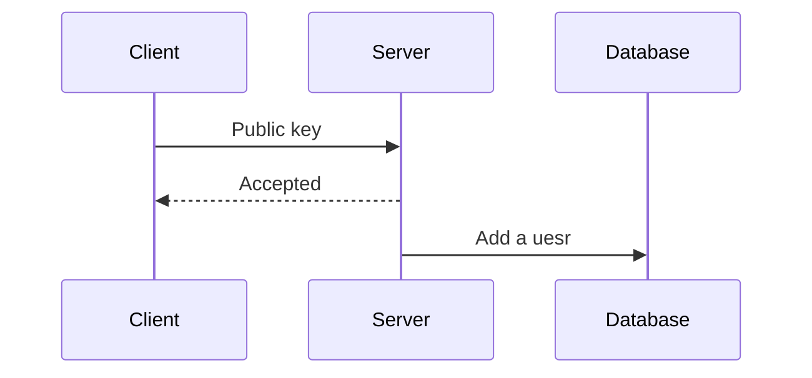

# Chat Island

The system is currently designed to be used with HTPPS.
Without HTPPS, it's vulnerable to be attacked by man-in-the-middle attacks.

## User and Authentication

Chat Island uses public and private key authentication.

### Register

A public key represents a user.

### Authentication

JWT is used to authenticate users statelssly.

## Messaging

Instant messaging is built on the top of websocket in real time.

### Whisper

Users can talk with each other via public keys.

