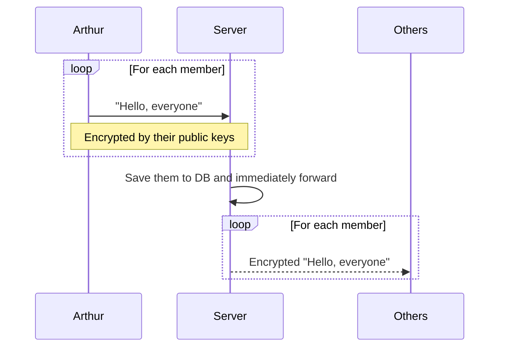

# Chat Island

Instant messaging is built on the top of websocket in real time.

## Sequence

### Register

Chat Island uses public and private key authentication.
A public key represents a user.

### Authentication

After building a websocket connection,
sending a challenge for authentication.

## Whisper

Users can talk with each other via public keys.

## Chat Room

Uers can create a chat room,
and invite others by adding other public keys into the member list.

Members can query the member list anytime.

